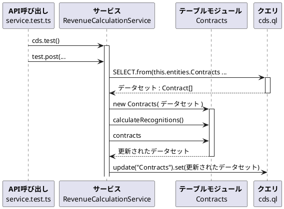

# テーブルモジュールパターンとCAP

SAPのサーバーサイド用のフレームワークであるCAPの設計に、**テーブルモジュール**(*Table Module*)が設計パターンとして使える。

ドメインモデルで設計するべき要件なのか、テーブルモジュールでよいとするかについて議論があってもいいと思う。CAPのドキュメントにも設計を開発者に選択権を委ねる旨が書かれている。しかし、開発者コミュニティでもあまり議論がされていないようだ。そこで、この記事ではテーブルモジュールという設計パターンを具体的な形で示す。

CAPのOData[^3]自体がウェブにおける二次元表のようなものであるから、テーブル形式をそのままドメインロジックにも用いるテーブルモジュールパターンはちょうどいい設計になることも多いのではないか。

本記事では、TypeScriptを使う。

## PoEAAにおけるテーブルモジュール

テーブルモジュールは、PoEAA[^1]でトランザクションスクリプト(*Transaction Script*)や、ドメインモデル(*Domain Model*)と並んで紹介されるドメインロジックのパターン。

ビジネスロジックを処理順序に沿って記述するのがトランザクションスクリプトで、ビジネスロジックをデータと一体化したものとして記述するのがドメインモデルであるとすると、テーブルモジュールは二次元の表に対する処理として記述する。

トランザクションスクリプトはその素朴さに、ドメインモデルはその表現力に、テーブルモジュールは保存先であるテーブルとの近さがメリットであるとされる。ドメインモデルはRMDBとのインタフェースに問題が集中しやすいが、テーブルモジュールにその問題はない。

| パターン名 | 説明 | つかいどころ |
|:----------|:---- |:-------------|
| トランザクションスクリプト | 外部から受け取った一つのリクエストに対しておこなう手続きごとにビジネスロジックをまとめる | ビジネスロジックがごくシンプルな場合  |
| ドメインモデル | 問題領域（ドメイン）のデータとふるまいを統合したオブジェクトモデル | ビジネスロジックが複雑である場合（たいていの場合） |
| テーブルモジュール | テーブルに含まれるすべての行に対して１インスタンスでビジネスロジックを処理する | データソースレイヤとのやり取りに便利なフレームワークが使える場合[^6] |

ドメインロジックであるテーブルモジュールは、クラスをインスタンス生成する際に、**レコードセット**(*Record Set*)をコンストラクタ引数にとる。レコードセットはひとつまたは複数のテーブルを一つにまとめたオブジェクト。言語やフレームワークによって呼び方が異なる。.NET(C#など)ではレコードセット、Javaでは結果セット(*Result Set*)という。

レコードセットはテーブル全体やクエリの結果を持つ。`Find`、`GetRows`などのようなコレクションとして使えるし、データベースへのアクセスをコントロールすることもできる。

いずれにしても要点は、二次元表[^4]とドメインロジックをひとまとめにするというところ。テーブルモジュールクラスは、ドメインロジックを実装したメソッドを外部に提供する。

## CAP TypeScriptにおけるテーブルモジュール

CAP TypeScriptの場合、C#とは違いレコードセットではなく配列を使う。実際には、`srv/service.cds` で定義すると、CAPが配列を提供してくれる。その配列をそのまま使う。以下これをデータセットと呼ぶ。データセットは各要素がオブジェクトの配列である。

当然、配列にはデータベースアクセスの機能はない。データベーステーブルアクセスにはCQLを使う。CQLをどこで書くかはテーブルモジュールパターンでも選択肢がある。テーブルゲートウェイ関数を本記事では作るが、イベントハンドラで渡されるデータでも十分。

テーブルモジュールクラスはインスタンス引数にデータセットをとる。同じくデータセットはOData APIにより外部に公開される。また、データベースの更新もこのデータセットが引数になる。

ビジネスロジックにも、UIにも、データソースにも、共通の形式を使う。テーブルモジュールパターンは共通の形式を使うところに特徴がある。モデルとデータソース、UIが同じ構造を持つことができれば、構造間の変換が不要になる。

複雑なモデルにテーブルモジュールパターンを適用するべきではないが、CAPでは、Deep Read や、Deep Update をサポートしてくれるので、多少の融通はきく（無理は禁物）。

ビジネスロジックは、GETの後(`this.after()`)、POSTの前(`this.before()`)、または独自に作成したActionやFunction(`this.on()`)のイベントで呼び出される。

## 実装するシナリオ

PoEAAに登場する例を本記事でも利用する。簡単のため登場するソフトウェアプロダクトの種類は2種類に絞らせてもらう。要件はソフトウェアライセンス収益の計算。プロダクトはワードプロセッサとスプレッドシート。収益の計上方法が異なり、ワードプロセッサは契約時に一括。スプレッドシートは30日おきに1/3ずつ計上される。

### データベーススキーマ

データソースは3つのテーブルで構成される。`Products`、`Contracts`、`RevenueRecognitions`が相互に関連付けされている。CAPでは、エンティティの名前はPascalケース（最初の一文字を大文字）で、複数形にする。複数形を使うのは、慣例ではあるがテーブルが複数行を持つから。

```plantuml
hide circle
hide methods
entity Products <<table>>{
  ID : Integer
  name : String
  type : String
}
entity Contracts <<table>>{
  ID : Integer
  whenSigned : Date
  amount : Decimal
}
entity RevenueRecognitions <<table>>{
    items : UUID
    amount : Decimal
    date : Date
}
Contracts "*" -> "1" Products
RevenueRecognitions "*" -> "1" Contracts
```

```cds: db/schema.cds
namespace db;

entity Products {
  key ID : Integer;
  name : String;
  type : String;
}

entity Contracts {
  key ID : Integer;
  whenSigned : Date;
  amount : Decimal;
  product : Association to Products;
  revenueRecognitions : Composition of many RevenueRecognitions on revenueRecognitions.contract = $self;
}

entity RevenueRecognitions {
    key items : UUID;
    amount : Decimal;
    date : Date;
    contract : Association to Contracts;
}
```
### サービス

ユースケースがソフトウェア収益の計算であるので、そのためにサービスを1つ作成する。

サービスの命名はCAPの設計において重要。ここでは、`RevenueCalculationService`とした。ActionをエンティティにBindされている。要件によってUnboundにするという設計にすることもありうる。URLをどのようにしたいかによって決まる。

エンティティにBindする場合、`revenue-calculation/Contracts(1)/calculateRecognitions` のようにエンティティを示す `Contracts` の後にキーを含める必要がある。Unboundでは必要ない。

```cds: srv/service.cds
using {db} from '../db/schema';

service RevenueCalculationService {
    entity Contracts as projection on db.Contracts 
    actions {
            action calculateRecognitions(contractID: Integer) ;
    }
}
```

####  サービスの名づけのコツ

CAPでは原則として、サービスをユースケースの単位（ユーザとシステムの一連のインタラクション）で作成する。すると、基本的にエンティティの名前とは異なるものになる。また、サービスルート名としてURLの一部となることを勘案して定義する。

ユースケースを表現する名詞にServiceをつけて定義することが多いが、Serviceという語を含めなくてもよい。

| エンティティ  | テーブルモジュールクラス名  | データ型     | ユースケース           | サービス名           | サービスルート名 |
| ------------ |--------------------------| ------------ | --------------------- | --------------- | -------- |
| `Contracts`  | `Contracts`              | `Contract`   | ソフトウェア収益の計算  | `RevenueCalculationService` | `revenue-calculation` |
| `Books`      | `Books`                  | `Book`       | 顧客が本を注文する      | `BookshopService` | `bookshop` |
| `Todos`      | `Todos`                  | `Todo`       | ToDo管理を行う         | `TodoService` | `todo` |

クラスと型はTypeScriptにおいて名前空間が同じなのでサービス名とデータ型名を同じにすることはできない。サービス名は実装クラス(Class)の名前になり、データ型(Type)と同じ名前空間だから。

ただ、サービス名に、**データ型**+`Service`という名づけをする方法はとれる。サービスルート名はサービス名に`Service`が含まれているとき、`Service`が取り除かれた名前になるからだ。

仮にサービス名に`ContractService`と名付けると、サービスルート名は`contract`となる。カスタムコードで用いるクラス名は `ContractService` となるので、集約のデータモデルを定義する型 (_Type_)　やドメインモデルを定義するクラス・インタフェースには単数形の　`Contract`　を使うことができる。

### シナリオのシークエンス

テーブルモジュールを使うまでの道のりをシークエンスで示す。

ここではJestを使ってユニットテストを行う例でシークエンスを示す。`service.test.ts`のJestセットアップにて`cds.test()`よりテスト環境を生成。テストケース内から`test.post()`関数を使って`RevenueCalculationService`クラスの`calculateRecognition`メソッドを呼び出す。

イベントハンドラから、CAPのクエリ`cds.ql`を使う。構文的には`SELECT.from(this.entities.Contracts,...)`というSQLそのまま。クエリ結果は TypeScript の型で定義した `Contract` の配列 `Contract[]` の型で得られる。これをデータセットとし、テーブルモジュールクラスである `Contracts` を生成する。

`Contracts`クラスにドメインロジックが集められており、本記事のシナリオではソフトウェアの収益計算を行う。サービスには `calculateRecognitions()`というメソッドを提供する。サービスから、`calculateRecognitions()`を呼び出し、インスタンス変数となっているデータセットはソフトウェアの収益計算によって更新され、状態が変わる。具体的には`RevenueRecognitions`が更新される。



## 実装

### 構成

サービス `RevenueCalculationService` を実装する同名のサービスクラス `RevenueCalculationService`に加え、テーブルモジュールクラス `Contracts` を同一のモジュール `service.ts` に含める。

```plantuml
hide circle
hide members
interface IRevenueCalculationService  as "RevenueCalculationService" <<SERVICE>> {}
class RevenueCalculationService <<CLASS>>{}
class Contracts <<CLASS>>{}

RevenueCalculationService .|> IRevenueCalculationService
Contracts <- RevenueCalculationService
```
#### 利用するモジュール

CAPでは規約により、拡張子違いの同名のファイルを実装に使う。サービスのCDSファイル名と実装用のファイル名は拡張子だけが違う。TypeScriptを使うので、`service.ts`となる。

CDSはファサードとして `cds` をインポートすると、`cds.ApplicationService`や、`cds.ql`など、CDSのフレームワークで提供される機能にアクセスできる。`power-assert`は実装中に足掛かりのために使うアサートライブラリ（詳細は省略）。

```typescript: srv/service.ts
import cds from "@sap/cds";
import assert from "power-assert";
```
#### TypeScriptの型の定義

データセットのデータ型を`Type`構文で定義する。型の命名はデータソーススキーマのエンティティ名が複数形であったのに対して**単数形**にする。Pascalケースであるところはエンティティと同じ。CDSで定義した内容を二重で定義することになる。CDSの定義をTypeScriptにも利用したい場合にはTyperを使うことができるが、Typerをうまく使うためには命名規約に注意する必要がある。自分は独自に書き下す方が好み。

```typescript: srv/service.ts
type Contract = {
  ID: number;
  whenSigned: string;
  amount: number;
  product: Product | undefined;
  revenueRecognitions: RevenueRecognition[] | undefined;
};

type Product = {
  ID: number;
  name: string;
  type: string;
};

type RevenueRecognition = {
  items: string;
  amount: number;
  date: string;
  contract_ID: number;
};
```

#### テーブルモジュールクラス `Contracts`

テーブルモジュールクラスはドメインロジックを記述する場所となる。クラス名はエンティティと同じ `Contracts` とする。

##### コンストラクタ

コンストラクタ引数の型は上記で定義した`Contract[]`。データセットがコンストラクタ引数となり、テーブルモジュールクラス内でアクセスできる。テーブルモジュールは、たいていの場合カーソル（現在行）を使う。今回は`_index`をカーソルとして使う。コンストラクタ内で初期化しておく。

```typescript: srv/service.ts
export class Contracts {
  private _index: number;
  constructor(private _dataset: Contract[]) {
    this._dataset = _dataset;
    this._index = 0;
  }
  /*...*/
}
```

##### ビジネスロジック： `calculateRecognitions` メソッド

ビジネスロジックは、テーブルモジュールクラス `Contracts`のメソッド`calculateRecognitions`に定義する。

###### メソッド引数

テーブルモジュールのメソッドはたいていの場合、引数にキーとなるIDをとる。

```typescript: srv/service.ts
export class Contracts {
  /*...*/
  calculateRecognitions(contractID: number): void { /*...*/ }
  /*...*/
}
```

###### 更新対象の特定

メソッドの中でデータセットから処理の対象の行を選び出す。カーソル `_index` をその行番号にする。選ばれた行は `contractRow` で保持。

ガード節はやや煩雑。テーブルモジュールパターンの場合には、どうしても必要になる。ドメインモデルの場合には値オブジェクトを中心に組み立てることができる。ドメインモデルの方がガード節は整理しやすいと思う。

```typescript: srv/service.ts
export class Contracts {
  /*...*/
  calculateRecognitions(contractID: number): void { 
    this._index = this._dataset.findIndex(
      (contract) => contract.ID == contractID,
    );
    const contractRow = this._dataset[this._index];

    if (contractRow === undefined) return;
    if (contractRow.product === undefined) return;
    if (contractRow.amount === undefined) return;
    /*...*/ 
  }
  /*...*/ 
}
```

###### 条件分岐と収益認識計算・データセットの更新１

ソフトウェアのプロダクトタイプ(`contractRow.product.type`)が、`WP`（ワードプロセッサ）の時には、収益認識を契約日とする。収益認識用の行を1行追加(push)する。

収益認識用の配列（テーブル）`rr: RevenueRecognition[]`は、初期値は`[]`であるが`rr.push()`によって結果がレコードとして追加される。インスタンス変数の`_dataset`の更新は、配列のインデックスとしてカーソル変数 `_index` を用いシャローコピーにより更新する。

```typescript: srv/service.ts
export class Contracts {
  /*...*/
  calculateRecognitions(contractID: number): void { 
    /*...*/ 
    const amount = contractRow.amount;
    const product = contractRow.product;

    if (contractRow.product.type === "WP") {
      let rr: RevenueRecognition[] = [];
      rr.push({items: cds.utils.uuid(), amount: amount, date: contractRow.whenSigned, contract_ID: contractRow.ID });
      this._dataset[this._index].revenueRecognitions = [...rr];
    }
    /*...*/ 
  }
  /*...*/ 
}
```

###### 条件分岐と収益認識計算・データセットの更新２

`SS`（スプレッドシート）の場合には、収益認識を3回に分ける。金額を３等分にし、日付も契約日(`whenSigned`)、契約日から30日後、同60日後の3種類を用意する。

金額を3分割するのは`allocate_amount()`、3つの日付にするのは、`allocate_date()`。それぞれプライベートメソッドにする。

テーブルモジュールパターンでも、サービスクラスからドメインロジックを分けて責務を明確にしているので、ロジックの置き場所に迷わない。

```typescript: srv/service.ts
export class Contracts {
  /*...*/
  calculateRecognitions(contractID: number): void { 
    /*...*/ 
    if (product.type === "SS") {
      let rr: RevenueRecognition[] = [];
      const alloc_amount = this.allocate_amount(amount, 3);
      const alloc_date = this.allocate_date(new Date(contractRow.whenSigned),3);

      rr.push({ items: cds.utils.uuid(), amount: alloc_amount[0], date: alloc_date[0], contract_ID: contractRow.ID });
      rr.push({ items: cds.utils.uuid(), amount: alloc_amount[1], date: alloc_date[1], contract_ID: contractRow.ID });
      rr.push({ items: cds.utils.uuid(), amount: alloc_amount[2], date: alloc_date[2], contract_ID: contractRow.ID });
      this._dataset[this._index].revenueRecognitions = [...rr];
    /*...*/ 
    }
  /*...*/ 
  }
}
```

##### プライベートメソッド：契約金額から収益金額の算出（案分）

金額を3等分にする処理は、ありがちだが煩雑な処理になる。端数は小数点第2位までとし、切り捨てした結果と、それに0.01を加算した結果をそれぞれ用意しておく。分割した明細のうち剰余の数だけ加算した方を選び、残りは切り捨てした方を結果とする。

こういったビジネスロジックは、`allocate_amount()`というメソッド名とテーブルモジュールクラス `Contracts`という適切な置き場所がないと意味不明になりがち。

```typescript: srv/service.ts
export class Contracts {
  /*...*/
  allocate_amount(amount: number, by: number): number[] {
    const lowResult = Math.floor((amount / by) * 100) / 100;
    const highResult = lowResult + 0.01;
    const result = [];
    let remainder = (amount * 100) % by;
    for (let i = 0; i < by; i++) {
      result.push(i < remainder ? highResult : lowResult);
    }
    return result;
  }
  /*...*/ 
}
```

##### プライベートメソッド：契約日から収益認識日付の算出（追加日数の計算）

日付を3種類用意する処理も、`allocate_date()`というメソッド名がないと意味不明になりがち。契約日、契約日から30日後、契約日から60日後の日付を配列で返す。それぞれ日付を日付のシリアル値にして追加日数を加算し、シリアル値から日付型に戻した後、`YYYY-MM-DD`形式にする。

```typescript: srv/service.ts
export class Contracts {
  /*...*/
  allocate_date(date: Date, by: number) {
    let rr_date = [];
    for (let i = 0; i < by; i++) {
      let rr_date_base = date;
      rr_date_base.setDate(rr_date_base.getDate() + i * 30);
      rr_date.push(rr_date_base.toISOString().split("T")[0]);
    }
    return rr_date;
  }
  /*...*/ 
}
```

#### サービスクラス `RevenueCalculationService`

CDSで定義したサービスと同名のクラスを定義。`cds.ApplicationService`を継承。このクラスはイベントハンドラを定義するのが役目。

サービスに定義した`calculateRecognition`のイベントハンドラは`init()`にて追加する。独自実装のActionなので、`this.on()` で処理内容をゼロから作る。Bound Actionなので、エンティティ名 `this.entities.Contracts` が必要。

コールバック関数 `(req: cds.Request)=>{ ... }` の引数にはエンティティのデータは含まれないので、コールバック関数内で独自に取得する。関数を別途定義し`.call()`で呼び出す。`deepRead.call(...)`は、関数内で使われる`this`を引き渡すことができる。プライベートメソッドを定義する方法もあるが、サービスクラスの中にSQLを書きたくないために分けた。

テーブルモジュール自体に、RMDBへのクエリを行う機能を持たせる方針も考えられる。自分自身を生成するのに必要なレコードセットを生成するクエリを仕込んだファクトリーメソッドとする方法。ただ、SQLをテーブルモジュールに含めるとテーブルモジュールをテストするのにデータセットを自由に変えられないというデメリットがある。そのため不採用とした。

`deepRead.call()`で得た結果を `Contracts`の生成に使う。変数 `contracts` はドメインロジックが搭載されたインスタンスとなる。このインスタンスは状態を持っており、収益認識の計算処理を行うと状態が変わる。`contracts.calculateRecognitions()`は状態を変える処理で、返り値を持たない。

計算結果をデータベースに保存するため、`deepUpdate.call()`を行う。これも関数はクラス外で定義し、`.call()`で呼び出している。同じくSQLをサービスクラスの中で書きたくないという理由。

エンティティ `Contracts` に対してREST APIでGETをすると、イベントハンドラ `this.after("READ", this.entities.Contracts,...)` が定義されているので、コールバック関数`(contracts: Contract[]) => {...}`が呼び出される。

引数の型からわかるように、GETが行われたとき、引数のデータセットは`Contract[]`である。本記事では詳述しないが重要。UIに出力する前のビジネスロジックがある場合には、このイベントが使える。引数のデータセットからテーブルモジュールを生成。テーブルモジュールで実装したビジネスロジックを適用すればいい。

```typescript: srv/service.ts
export class RevenueCalculationService extends cds.ApplicationService {
  init() {
    this.on("calculateRecognitions",
    this.entities.Contracts, 
    async (req: cds.Request) => {
        const contracts = new Contracts(
          await deepRead.call(this, req.data.contractID),
        );
        contracts.calculateRecognitions(req.data.contractID);
        await deepUpdate.call(this, contracts.contracts);
      },
    );
    this.after("READ", this.entities.Contracts, (contracts: Contract[]) => {
      return contracts;
    });

    return super.init();
  }
}
```
#### テーブルデータゲートウェイ用の関数 `deepRead()`

SQLを分離するために、別途関数を定義した。PoEAAとの対応関係の都合上、テーブルデータゲートウェイ用の関数と呼ぶ。

`deepRead`関数内では `this` が使われている。この `this`は `.call()`の第一引数。ここではサービスクラス `RevenueCalculationService`。`this`がサービスなので`this.entities.Contracts` によってでエンティティを知ることができる。

`SELECT.from()`の第一引数はエンティティ。`this.`を使ってエンティティにアクセスする。

`SELECT.from()`の第二引数は**ディープ・リード**(_DEEP READ_)用のプロジェクション(_Projection_)。深い階層（コンポジション）と紐づいた項目はデフォルトだと無視される。無視させずに読み込ませるには、明示的にプロジェクションを指定する。

```typescript: srv/service.ts
async function deepRead(
  this: RevenueCalculationService,
  contractID: string,
): Promise<Contract[]> {
  return await SELECT.from(this.entities.Contracts, (o: any) => {
    o.ID,
      o.whenSigned,
      o.amount,
      o.product((p: any) => {
        p.ID, p.name;
        p.type;
      }),
      o.revenueRecognitions((r: any) => {
        r.items, r.amount, r.date, r.contract_ID;
      });
  }).where({ ID: contractID });
}
```
#### テーブルデータゲートウェイ用の関数 `deepUpdate()`

データベーステーブルを更新するためのSQLも、サービスクラスから分けて定義。データセットは一般に複数のレコードを保持しているが、データ更新は一行ずつ行う（もっとちゃんとした実装が必要だが本記事ではおこなわない）。

`deepUpdate()`関数は、CRUD的に `this.update()` を使っている。第一引数にエンティティ。第二引数に更新対象のキー。メソッドチェーンでつないだ`.set()`には更新対象のデータを与える。

```typescript: srv/service.ts
async function deepUpdate(
  this: RevenueCalculationService,
  contracts: Contract[],
): Promise<void> {
  for (let aContract of contracts) {
    await this.update(this.entities.Contracts, aContract.ID).set(aContract);
  }
}
```

### ユニットテスト

ユニットテストは、`describe`レベルで、`cds.test()`によってテスト環境を生成。生成された`test`のメソッド`post`を使って、`await test.post( ... )`でActionを呼び出す。テーブルの更新結果は、`test.get()`で呼び出して得られる。

`test.post()`関数の第一引数はPathだが、サービスルートの前の`/odata/v4/`からスタートする必要がある。そのあとにサービスルート、エンティティ、Actionと続ける。

`test.get()`関数の第一引数もPath。エンティティの後に、`?$expand=revenueRecognitions`と続けるとディープリード(Deep Read)が行われる。つけないと、コンポジションが展開されず無視される。

データは`db/data/`フォルダにCSVファイルを入れておいたものが使える（内容は省略）。

```typescript: test/service.test.ts
import * as cds from "@sap/cds";
/* ... */

describe("Contracts", () => {
  const test = cds.test(cds.root);

  afterAll(async () => {
    (await test).server.close();
  });
  beforeEach(async () => {
    await test.data.reset();
  });

/* .. */

it("should allow to run action : calculateRecognitions", async () => {
    await test.post(
      "/odata/v4/revenue-calculation/Contracts(2)/calculateRecognitions",
      { contractID: 2 },
    );
    const { data } = await test.get(
      "/odata/v4/revenue-calculation/Contracts(2)?$expand=revenueRecognitions",
    );
    expect(data.revenueRecognitions.length).toEqual(3);
    expect(data.revenueRecognitions[0].amount).toEqual(66.67);
    expect(data.revenueRecognitions[1].amount).toEqual(66.67);
    expect(data.revenueRecognitions[2].amount).toEqual(66.66);
    expect(data.revenueRecognitions[0].contract_ID).toEqual(2);
    expect(data.revenueRecognitions[1].contract_ID).toEqual(2);
    expect(data.revenueRecognitions[2].contract_ID).toEqual(2);
    expect(data.revenueRecognitions[0].date).toEqual("2016-02-01");
    expect(data.revenueRecognitions[1].date).toEqual("2016-03-02");
    expect(data.revenueRecognitions[2].date).toEqual("2016-05-01");
  });
});
```
[^1]: Patterns of Enterprise Application Architecture (Addison-Wesley Signature Series (Fowler)) (English Edition); https://www.amazon.co.jp/exec/obidos/ASIN/B008OHVDFM
[^3]: OASIS Open Data Protocol: https://groups.oasis-open.org/communities/tc-community-home2?CommunityKey=e7cac2a9-2d18-4640-b94d-018dc7d3f0e2
[^4]: SAP ABAPなら内部テーブルを活用して実装するところだと思う。`data( lo ) = new TABLE_MODULE( internal_table )`のように。
[^6]: PoEAAの中では C#


